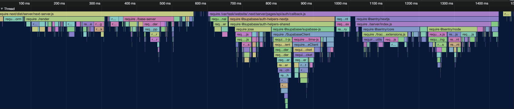

<div align='center'>
    <br/>
    <br/>
    <br/>
    <p>Next.js cold start profiling for the masses</p>
    <br/>
    <br/>
</div>

## Usage

Add a `vercel.json` in your Next.js app directory top level with the following contents:

```json
{
    "builds": [
        {
            "src": "package.json",
            "use": "https://profile-next-cold-starts.vercel.app/builder.tgz"
        }
    ]
}
```

After you deploy your application, you can append `?vercel-profile-cpu` to an url to download the cpu profile and `?vercel-profile-require` to download a profile of all`require` calls (which is usually what causes long cold starts).

The file will end with `hot` or `cold` based on wether the function was hot (already booted) or cold.

After you download the profile, you can use [trace.cafe](https://trace.cafe) to analyze it or you can also use the VSCode built in visualizer, simply opening the file in VSCode.

## How It Works

This repository contains a fork for the Vercel builder, the `server-launcher.ts` file has been modified to add the profiling code.

## Example


